# UniversalSFSymbolsPickerの利用可能なオプション

[English](OPTIONS.md) | **日本語**

このページでは、UniversalSFSymbolsPickerで利用可能なすべてのオプションについての説明と設定値の違いについて説明します。

UniversalSFSymbolsPickerで利用可能なすべてのオプションとデフォルト値は次の通りです。必須以外のオプションにはデフォルト値が用意されているため、変更する必要のないものは記載せずに実装しても問題ありません。

| パラメータ名 | 型 | デフォルト値 |
| :--- | :--- | :--- |
| [`isPresented`](#ispresented) | `Binding<Bool>` | -（必須） |
| [`selection`](#selection) | `Binding<String?>` | -（必須） |
| [`showAs`](#showas) | `SFSymbolPickerDisplayMode` | `.sheet` |
| [`controlBarPosition`](#controlbarposition) | `SFSymbolPickerControlBarPosition` | `.bottom` |
| [`showSearchBar`](#showsearchbar) | `Bool` | `true` |
| [`prompt`](#prompt) | `String?` | `nil` |
| [`searchText`](#searchtext) | `Binding<String>` | `.constant("")` |
| [`showCategoryPicker`](#showcategorypicker) | `Bool` | `true` |
| [`showCategorySectionLabel`](#showcategorysectionlabel) | `Bool` | `true` |
| [`categoryLabelVisibility`](#categorylabelvisibility) | `SFSymbolPickerCategoryLabelVisibility` | `.default` |
| [`categoryLabelStyle`](#categorylabelstyle) | `SFSymbolPickerCategoryLabelStyle` | `.both` |
| [`defaultCategory`](#defaultcategory) | `String` | `"all"` |
| [`includedCategories`](#includedcategories) | `[String]?` | `nil` |
| [`excludedCategories`](#excludedcategories) | `[String]?` | `nil` |
| [`customCategories`](#customcategories) | `[CustomCategory]` | `[]` |
| [`showIconName`](#showiconname) | `Bool` | `true` |
| [`excludeRestricted`](#excluderestricted) | `Bool` | `false` |
| [`iconScale`](#iconscale) | `Int` | `5` |
| [`iconSpacing`](#iconspacing) | `Int` | `5` |
| [`showRecents`](#showrecents) | `Bool` | `false` |
| [`maxRecents`](#maxrecents) | `Int` | `20` |
| [`renderingMode`](#renderingmode) | `SymbolRenderingMode` | `.monochrome` |
| [`isGradient`](#isgradient) | `Bool` | `false` |
| [`primaryColor`](#primarycolor--secondarycolor--tertiarycolor) | `Color` | `.primary` |
| [`secondaryColor`](#primarycolor--secondarycolor--tertiarycolor) | `Color?` | `nil` |
| [`tertiaryColor`](#primarycolor--secondarycolor--tertiarycolor) | `Color?` | `nil` |
| [`variableValue`](#variablevalue) | `Binding<Double?>` | `.constant(nil)` |
| [`sfSymbolsVersion`](#sfsymbolsversion) | `Double?` | `nil` |

## コア・基本
### `isPresented`

**必須のオプションです。**\
シートやポップオーバーの表示状態を管理します。

`NavigationLink`を使って全画面遷移させる場合は、`.constant(true)`を指定します。

### `selection`

**必須のオプションです。**\
選択されているアイコンの状態を管理します。

### `showAs`

表示モードを指定します。

利用可能なオプションは以下の通りです。

- `.sheet`（デフォルト）
  - シートとして表示する場合に指定します。
- `.popover`
  - シート以外の方法で表示する場合に指定します。

> [!NOTE]
> `.sheet`では、シート表示時の操作用にツールバーとツールバーアイテムが追加されます。macOSではカスタムのボトムバーが追加されます。このモードではほとんどシステムネイティブに近いレイアウトで操作することができますが、シート以外で表示した場合にレイアウトが崩れる可能性があります。
>
> `.popover`ではツールバーの代わりにカスタムのコントロールバー（カスタム検索バーとカテゴリピッカーボタン）が追加されます。様々な表示方法でもレイアウトが崩れにくいです。
>
> tvOSではどちらを選んでもレイアウトは変わりませんが、他のプラットフォームに合わせ、`.popover`を使用することをおすすめします。

### `controlBarPosition`

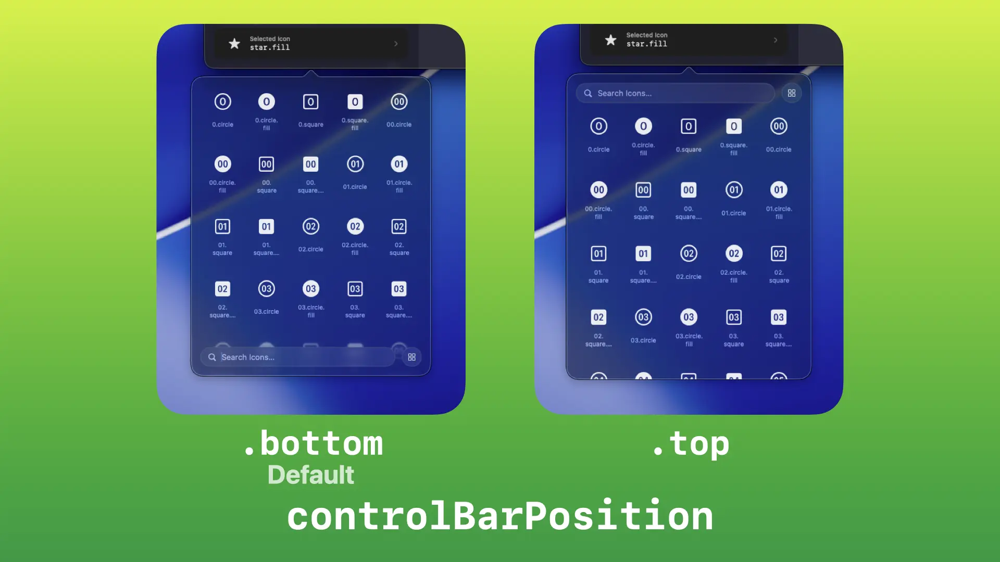

コントロールバー（カスタム検索バーとカテゴリピッカーボタン）の表示位置を指定します。

利用可能なオプションは以下の通りです。

- `.bottom`（デフォルト）
  - コントロールバーを下に配置します。
- `.top`
  - コントロールバーを上に配置します。

> [!NOTE]
> macOSでシートとして表示している場合、このオプションはカスタム検索バーのみ影響を受けます。`showSearchBar: false`を指定している場合、macOSではこのオプションを変更してもレイアウトに影響を与えません。
>
> watchOSとtvOSでは操作性の都合上、このオプションの影響は受けず、コントロールバーは常に上に表示されます。

## 検索関連
### `showSearchBar`


UniversalSFSymbolsPickerが提供するカスタム検索バーを表示するかどうかを指定します。

利用可能なオプションは以下の通りです。

- `true`（デフォルト）
  - カスタム検索バーを表示します。
- `false`
  - カスタム検索バーを非表示にします。

> [!NOTE]
> シートや`NavigationLink`などを使って表示する場合、`.searchable`モディファイアを使ってシステム標準の検索バーを表示させることができます。\
> その場合、カスタム検索バーと重複してしまう（検索バーが2つ表示されてしまう）ため、`.searchable`モディファイアを使用する場合は`false`を指定します。

### `prompt`

検索バーに表示するプレースホルダテキストを指定します（デフォルト: `nil`）。`String(localized: "テキスト")` のように指定することで多言語対応が可能です。

何も指定しなかった場合は、デフォルトの`Search Icons…`（`アイコンを検索…`）が表示されます。

### `searchText`

検索機能を使用する場合、検索キーワードをバインディングする必要があります（デフォルト: `.constant("")`）。

`showSearchBar: false`を指定している場合でも、検索機能を使用する場合は必須です（指定しなかった場合、検索は機能しません）。

## カテゴリ
### `showCategoryPicker`

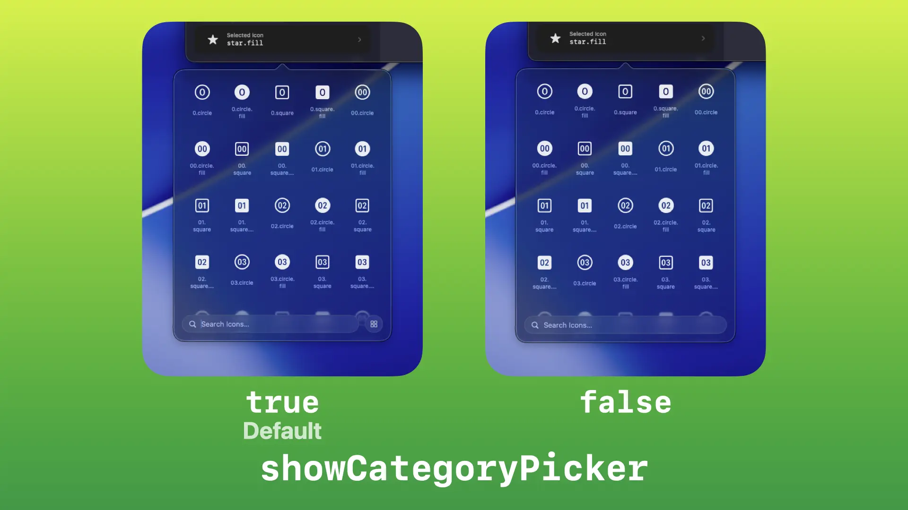

カテゴリを選択するピッカーを表示するかどうかを指定します。

利用可能なオプションは以下の通りです。

- `true`（デフォルト）
  - カテゴリピッカーを表示します。
- `false`
  - カテゴリピッカーを非表示にします。

### `showCategorySectionLabel`

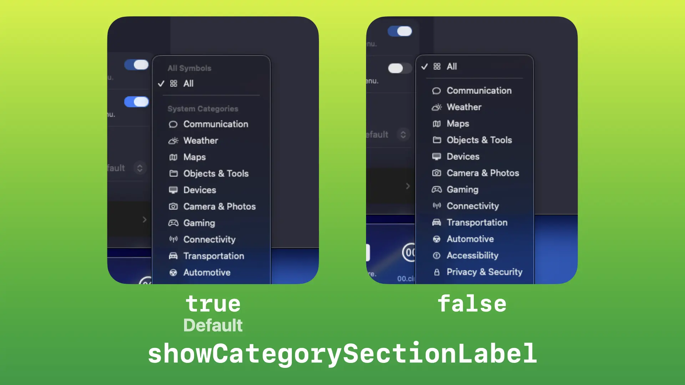

カテゴリピッカー内のセクションラベル（見出し）を表示するかどうかを指定します。

> [!NOTE]
> このオプションはiOS 18.0以降、macOS 15.0以降、tvOS 18.0以降、watchOS 11.0以降、visionOS 2.0以降に対応します。それ以前のOSではこのオプションは無視されます。

利用可能なオプションは以下の通りです。

- `true`（デフォルト）
  - セクションラベルを表示します。
- `false`
  - セクションラベルを非表示にします。

### `categoryLabelVisibility`

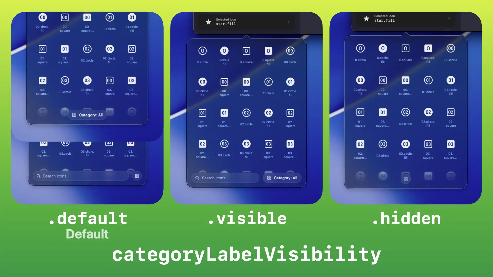

カテゴリピッカーのラベルの表示状態を指定します。

利用可能なオプションは以下の通りです。

- `.default`（デフォルト）
  - プラットフォームや表示モード、検索バーの有無などに応じて自動的に調整されます。
- `.visible`
  - 常にラベルを表示します。
- `.hidden`
  - 常にラベルを非表示にします。

> [!NOTE]
> watchOSではこのオプションにかかわらず常にラベルが表示されます。

### `categoryLabelStyle`

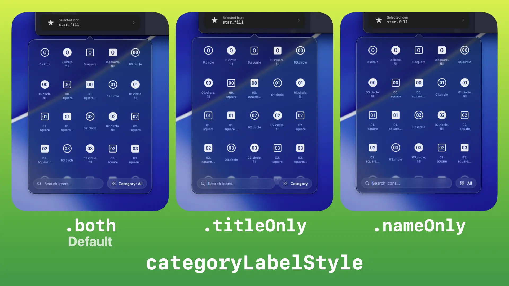

カテゴリピッカーのラベルが表示されているときのラベルの表示スタイルを指定します。

利用可能なオプションは以下の通りです。

- `.both`（デフォルト）
  - `Category: All`（`カテゴリ: すべて`）のように、`Category`（`カテゴリ`）というラベルタイトルと選択されているカテゴリ名の両方を表示します。
- `.titleOnly`
  - `Category`（`カテゴリ`）というラベルタイトルのみ表示します。
- `.nameOnly`
  - `All`（`すべて`）のように、選択されているカテゴリ名のみ表示します。

### `defaultCategory`

ピッカーを開いたときに最初に選択されているカテゴリを指定します（デフォルト: `"all"`）。

利用可能なオプションは以下の通りです。

- `"all"`（デフォルト）
  - `All`（`すべて`）が選択されている状態にします。
- `"communication"`
  - `Communication`（`コミュニケーション`）が選択されている状態にします。
- `"weather"`
  - `Weather`（`天気`）が選択されている状態にします。
- `"maps"`
  - `Maps`（`マップ`）が選択されている状態にします。
- `"objectsandtools"`
  - `Objects & Tools`（`オブジェクトとツール`）が選択されている状態にします。
- `"devices"`
  - `Devices`（`デバイス`）が選択されている状態にします。
- `"cameraandphotos"`
  - `Camera & Photos`（`カメラと写真`）が選択されている状態にします。
- `"gaming"`
  - `Gaming`（`ゲーム`）が選択されている状態にします。
- `"connectivity"`
  - `Connectivity`（`コネクティビティ`）が選択されている状態にします。
- `"transportation"`
  - `Transportation`（`交通`）が選択されている状態にします。
- `"automotive"`
  - `Automotive`（`自動車`）が選択されている状態にします。
- `"accessibility"`
  - `Accessibility`（`アクセシビリティ`）が選択されている状態にします。
- `"privacyandsecurity"`
  - `Privacy & Security`（`プライバシーとセキュリティ`）が選択されている状態にします。
- `"human"`
  - `Human`（`人`）が選択されている状態にします。
- `"home"`
  - `Home`（`ホーム`）が選択されている状態にします。
- `"fitness"`
  - `Fitness`（`フィットネス`）が選択されている状態にします。
- `"nature"`
  - `Nature`（`自然`）が選択されている状態にします。
- `"editing"`
  - `Editing`（`編集`）が選択されている状態にします。
- `"textformatting"`
  - `Text Formatting`（`テキストフォーマット`）が選択されている状態にします。
- `"media"`
  - `Media`（`メディア`）が選択されている状態にします。
- `"keyboard"`
  - `Keyboard`（`キーボード`）が選択されている状態にします。
- `"commerce"`
  - `Commerce`（`コマース`）が選択されている状態にします。
- `"time"`
  - `Time`（`時計`）が選択されている状態にします。
- `"health"`
  - `Health`（`ヘルスケア`）が選択されている状態にします。
- `"shapes"`
  - `Shapes`（`図形`）が選択されている状態にします。
- `"arrows"`
  - `Arrows`（`矢印`）が選択されている状態にします。
- `"indices"`
  - `Indices`（`インデックス`）が選択されている状態にします。
- `"math"`
  - `Math`（`数学`）が選択されている状態にします。
- カスタムカテゴリID
  - [`customCategories`オプション](#customcategories)を使用して追加した独自のカスタムカテゴリが選択されている状態にします。

### `includedCategories`

ピッカーで利用可能にするカテゴリのIDを配列で指定します（デフォルト: `nil`）。\
システムカテゴリのID（`"weather"`など）のほか、カスタムカテゴリの`id`を指定することも可能です。

カテゴリを指定すると、`All`（`すべて`）カテゴリと指定したカテゴリだけが表示されるようになり、それ以外のカテゴリに含まれるアイコンは`All`（`すべて`）カテゴリからも除外されます。

> [!NOTE]
> すべてのカテゴリを含めたい場合は、`"all"`ではなく`nil`を指定する（あるいはオプションを省略する）必要があります。UniversalSFSymbolsPickerの内部では`"all"`というカテゴリIDは存在しないため、それを指定した場合は（`"all"`というIDのカスタムカテゴリを追加しない限り）存在しないカテゴリが指定されたとみなされ、アイコンが1つも表示されなくなります。

### `excludedCategories`

ピッカー全体から除外するカテゴリのIDを配列で指定します（デフォルト: `nil`）。\
システムカテゴリのIDのほか、カスタムカテゴリの`id`を指定することも可能です。

カテゴリを指定すると、指定したカテゴリが一覧から除外され、`All`（`すべて`）カテゴリからも除外されます。

> [!NOTE]
> `includedCategories`オプションと組み合わせて使用した場合、`excludedCategories`オプションの内容が優先されます。つまり、それぞれに別のカテゴリを指定した場合、`includedCategories`で指定したカテゴリに含まれるアイコンのうち、`excludedCategories`で指定したカテゴリにも含まれるアイコン（両方のカテゴリに所属するアイコン）が除外されます。\
> 例えば、`includedCategories`に`["weather", "maps"]`、`excludedCategories`に`["transportation"]`を指定した場合、`maps`カテゴリと`transportation`カテゴリの両方に含まれるアイコンである`car`などが除外されます。
> 
> `"all"`を除外することはできません（指定しても何も起こりません）。

### `customCategories`

独自のカスタムカテゴリを追加することができます（デフォルト: `[]`）。

`[CustomCategory]`の配列を指定します。

`CustomCategory`で設定可能なオプションは以下の通りです。

- `id` (`String` / 省略可能)
  - カテゴリの一意の識別子です（デフォルト: `UUID().uuidString`）。任意の文字列（例: `"my-custom-category"`）を指定できるため、`defaultCategory` や `includedCategories` などのオプションで使用する際などに便利です。
- `label` (`String` / **必須**)
  - カテゴリピッカーに表示されるカテゴリの表示名です。`String(localized: "表示名")` のように指定することで多言語対応が可能です。
- `icon` (`String` / **必須**)
  - カテゴリピッカーに表示されるカテゴリのアイコン名（SF Symbolsのアイコン名）です。
- `symbols` (`[String]` / 省略可能)
  - このカテゴリに含めるSF Symbolsのアイコン名を配列で指定します（デフォルト: `[]`）。
- `systemCategories` (`[String]` / 省略可能)
  - このカテゴリに結合して含める、既存のシステムカテゴリのID（`"weather"`, `"nature"`など）を配列で指定します（デフォルト: `[]`）。
- `excludedSymbols` (`[String]` / 省略可能)
  - このカテゴリから除外するアイコン名を配列で指定します。`systemCategories`から一部のアイコンを取り除く際に便利です（デフォルト: `[]`）。

> [!NOTE]
> `symbols`や`excludedSymbols`などで指定するアイコン名は、すべて内部の自動解決機能を通して処理されます。\
そのため、エイリアスがあるアイコン名（例えば`a`と`character`など）では、古いアイコン名または新しいアイコン名を指定した場合でも実行環境のOSがそのアイコンに対応していれば自動的に互換性のある最も新しいアイコン名に解決されて表示されます。\
なお、実行環境のOSが対応していない新しいアイコン名を指定した場合や存在しないアイコン名が入力された場合は、代わりに`questionmark.square.dashed`アイコン（点線の四角形で囲われたクエスチョンマークのアイコン）が表示されます。
> 
> 全体の[`includedCategories`](#includedcategories)または[`excludedCategories`](#excludedcategories)オプションを使って表示するアイコンを制限している場合でも、カスタムカテゴリの`symbols`オプションで直接指定されたアイコンについてはグローバルな除外設定を上書きしてカテゴリ内に表示させることができます。ただし、`All`（`すべて`）には表示されず、指定されたカスタムカテゴリ内にのみ表示されます。

#### 例

```swift
let myCustomCategories: [CustomCategory] = [
    // 任意の文字列をIDとして指定し、特定のアイコンを指定してカテゴリを作成する
    CustomCategory(
        id: "my-favorites",
        label: "Favorites",
        icon: "star.fill",
        symbols: ["star", "star.fill", "heart", "heart.fill"]
    ),
    // IDを省略して自動でUUIDを割り当て、アイコンの追加に加え、既存のシステムカテゴリの結合・特定アイコンを除外する
    CustomCategory(
        label: "Weather & Nature & Star Fill",
        icon: "leaf",
        symbols: ["star.fill"],
        systemCategories: ["weather", "nature"],
        excludedSymbols: ["tornado"]
    )
]

SFSymbolPicker(
    isPresented: $isPresented,
    selection: $selection,
    customCategories: myCustomCategories
)
```

## 表示とレイアウト
### `showIconName`

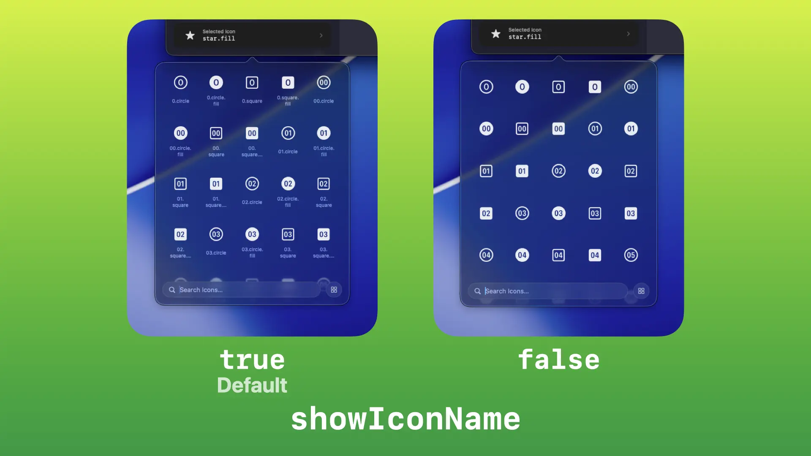

アイコンの名前を表示するかどうかを指定します。

- `true`（デフォルト）
  - アイコン名を表示します。
- `false`
  - アイコン名を非表示にします。

> [!NOTE]
> アイコン名を非表示にした場合、各アイコンは正方形グリッドで表示されるようになります。

### `excludeRestricted`


Appleの商標やサービス名など、制限付きアイコンを除外するかどうかを指定します。

- `false`（デフォルト）
  - すべてのアイコンを表示します。
- `true`
  - 制限付きアイコンがリストから除外されます。

> [!NOTE]
> `true`に設定していても、カスタムカテゴリの`symbols`オプションで直接指定した制限付きアイコンについては例外として扱われ、除外されずに表示されます。

### `iconScale`


アイコンの大きさを`1`〜`10`の範囲で指定します（デフォルト: `5`）。

数値が大きいほどアイコンが大きく表示されます。

> [!NOTE]
> 範囲外の数値が入力された場合、デフォルトの`5`にフォールバックされます。
>
> このオプションは`iconSpacing`と組み合わせて使用できます。

### `iconSpacing`

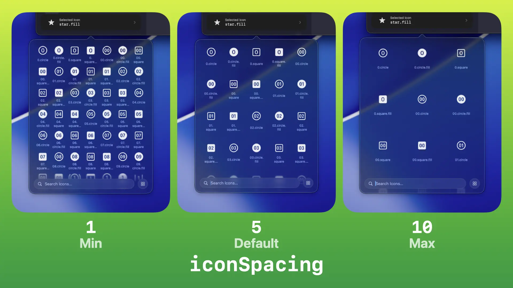

アイコン間の余白の大きさを`1`〜`10`の範囲で指定します（デフォルト: `5`）。

数値が大きいほどアイコンの間隔が広くなります。

> [!NOTE]
> 範囲外の数値が入力された場合、デフォルトの`5`にフォールバックされます。
>
> このオプションは`iconScale`と組み合わせて使用できます。

### `showRecents`


最近使ったアイコンの履歴項目を表示するかどうかを指定します。

利用可能なオプションは以下の通りです。

- `false`（デフォルト）
  - 最近使ったアイコンを表示しません。
- `true`
  - ピッカーの上部に最近使ったアイコンの項目を表示します。

> [!NOTE]
> `false`に設定されている場合、アイコンを選択しても履歴の更新は行われません。

### `maxRecents`

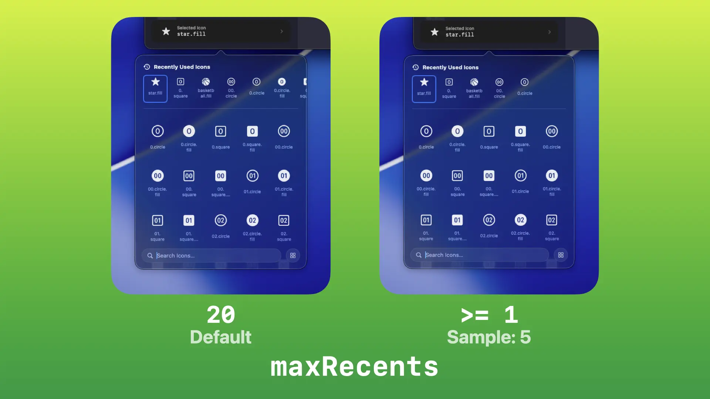

最近使ったアイコンとして保存・表示する最大数を`1`以上の数値で指定します（デフォルト: `20`）。

> [!NOTE]
> `0`以下の数値が入力された場合、デフォルトの`20`にフォールバックされます。
> 
> 既に保存されている履歴の数よりも小さくした場合、はみ出た分の履歴は削除されます。

## スタイリング
### `renderingMode`

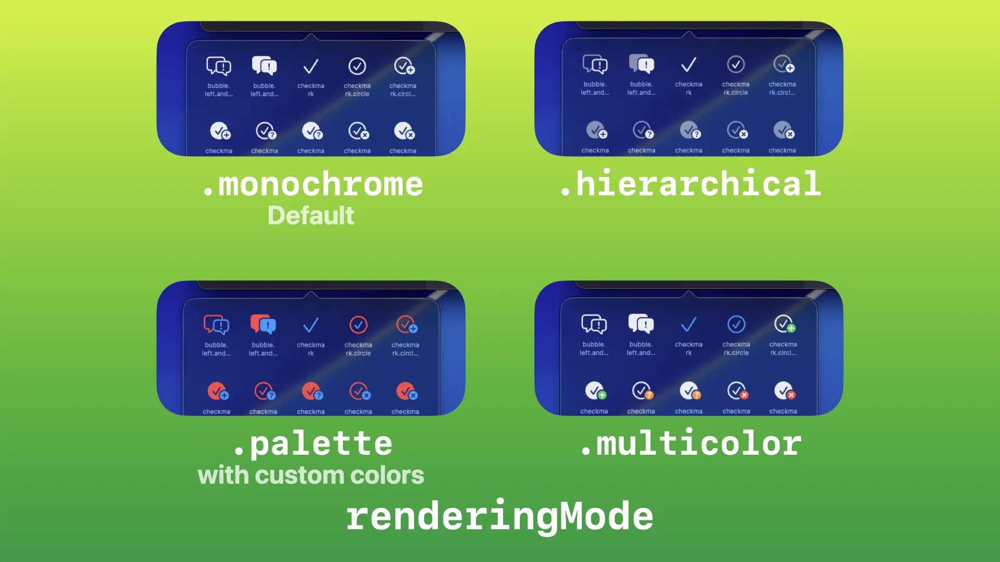

アイコンのレンダリングモードを指定します。

利用可能なオプションは以下の通りです。

- `.monochrome`（デフォルト）
  - モノクロでレンダリングします。
- `.hierarchical`
  - 階層でレンダリングします。
- `.palette`
  - パレットでレンダリングします。レイヤーごとの色は[`primaryColor` / `secondaryColor` / `tertiaryColor`](#primarycolor--secondarycolor--tertiarycolor)で指定できます。
- `.multicolor`
  - マルチカラーでレンダリングします。

### `isGradient`

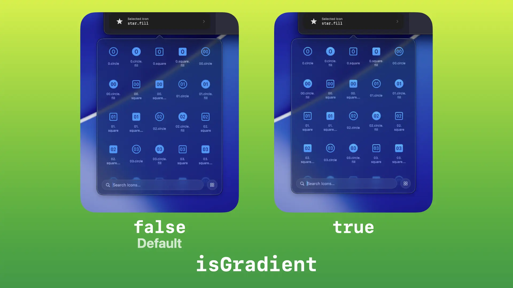

アイコンにグラデーションを適用するかどうかを指定します。

> [!NOTE]
> このオプションはiOS 26.0以降、macOS 26.0以降、tvOS 26.0以降、watchOS 26.0以降、visionOS 26.0以降に対応します。それ以前のOSではこのオプションは無視されます。

- `false`（デフォルト）
  - フラットなカラーでレンダリングします。
- `true`
  - グラデーションを適用してレンダリングします。

### `primaryColor` / `secondaryColor` / `tertiaryColor`

アイコンの色を指定します。

- `primaryColor`（デフォルト: `.primary`）
  - すべてのレンダリングモードで基本色として使用されます。
- `secondaryColor`（デフォルト: `nil`）
  - `.hierarchical`や`.palette`など、対応するレンダリングモードの2番目の色として使用されます。
- `tertiaryColor`（デフォルト: `nil`）
  - `.palette`など、対応するレンダリングモードの3番目の色として使用されます。

### `variableValue`

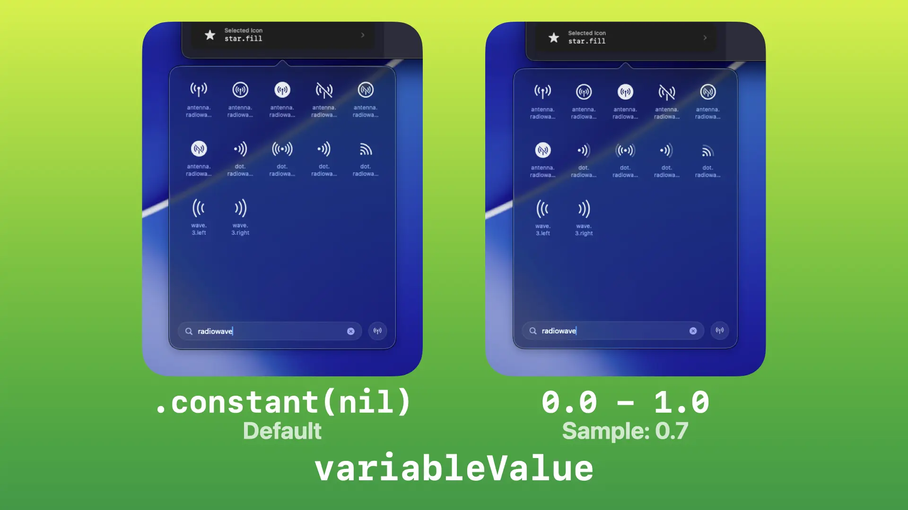

値をバインディングして、対応するアイコンを可変レンダリングします（デフォルト: `.constant(nil)`）。

`0.0`〜`1.0`の範囲で指定でき、バッテリー残量やゲージなど、可変値に対応したアイコンの表示をリアルタイムに変化させます。

## 高度
### `sfSymbolsVersion`

表示するSF Symbolsのバージョンを制限する場合に指定します（デフォルト: `nil`）。

特定のバージョン（例: `5.0`）を指定すると、そのバージョン以下のアイコンのみが表示されます。以降のバージョンで名称が変更されたアイコンでは、OSが対応している場合は新しい名前が使用されます。

カスタムカテゴリを使用して表示するアイコンを制御している場合、SF SymbolsやUniversalSFSymbolsPickerのアップデートによって新たなアイコンが追加された場合でも、ここでバージョンを制限しておくことでピッカー内に表示されるアイコンが変化しないように固定することができます。