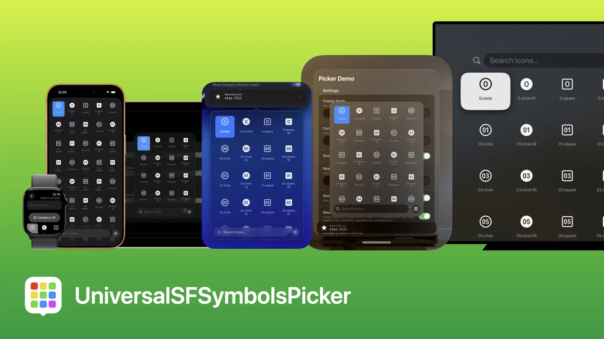
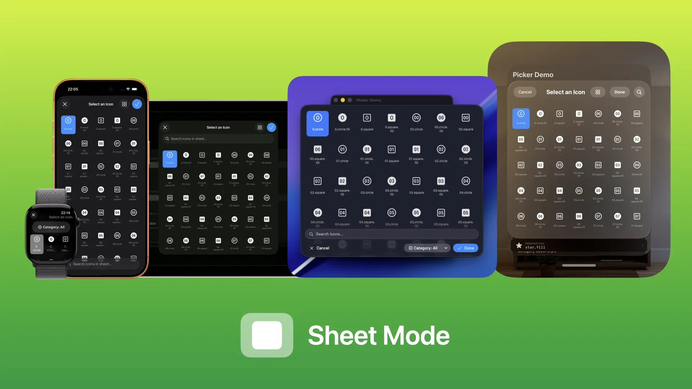
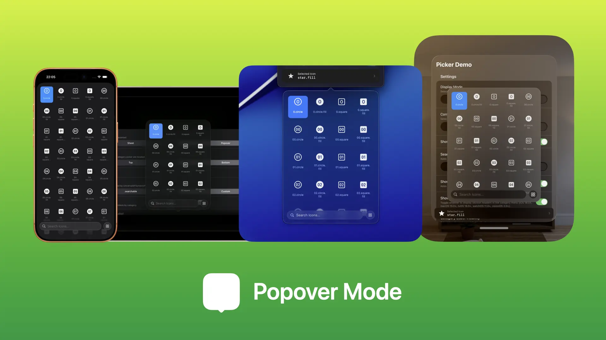
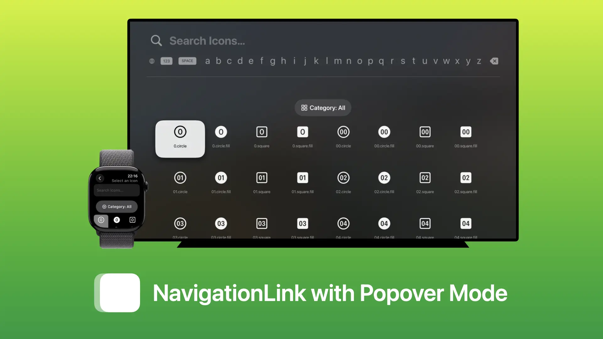
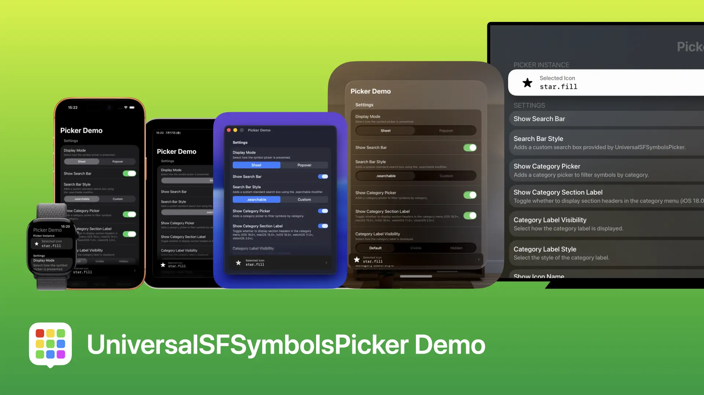
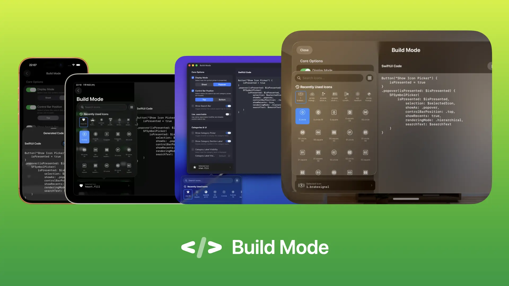

# UniversalSFSymbolsPicker

[English](../README.md) | **日本語**



UniversalSFSymbolsPickerは、様々なプラットフォームに対応し、高度にカスタマイズ可能なSF Symbolsピッカーを簡単に実装することができるSwiftパッケージです。

## 特徴

- **✅ シンプルなデザインで使いやすい**
  - アイコンがきれいに並び、現在選択されているアイコンがハイライトされて使いやすいように設計されています。
- **📱 幅広いプラットフォームに対応**
  - 様々なデバイスでUniversalSFSymbolsPickerをアプリに組み込むことができます。
- **🖼️ 選べる表示モード**
  - シートやポップオーバーなど、場面に応じて表示モードをカスタマイズすることができます。
- **🚀 ページネーション対応で軽快な動作**
  - 最初からすべてのアイコンを読み込まないため、非常に高速に動作します。
- **🔍 高速な検索機能**
  - すべてのアイコンの中から目的のアイコンを簡単に見つけ出すことができます。
- **🕒 最近使ったアイコンの履歴機能**
  - 最近選択したアイコンの履歴を表示させることができ、よく使うアイコンを履歴から見つけ出せます。
- **🔒 制限付きアイコンの除外機能**
  - Appleの商標やサービス名など、利用に制限のあるアイコンを除外することができます。
- **🌐 ロケールやバリアント別アイコンの適切な除外（オリジナルのみ表示）**
  - 地域や言語によって異なるバリエーションのアイコンが除外され、地域や言語ごとに自動で最適な表示に切り替わるオリジナルアイコンのみが表示されます。
- **🗄️ カテゴリごとのフィルタリングに対応**
  - カテゴリだけに絞り込むことができるため、目的のアイコンを簡単に探し出すことができます。
- **📝 カスタムカテゴリの追加に対応**
  - 組み込みたいアプリにぴったりなアイコンだけを選定してカスタムカテゴリとして追加することができます。
- **🎨 様々なレンダリングモード・可変値表示に対応**
  - フラットな表示に加え、表示色を変更したり、数値に基づく可変アイコンを表示したりすることができます。
- **🎛️ 非常に高度なカスタマイズ機能**
  - 様々なカスタマイズオプションが用意され、組み込みたいアプリに最適な状態にカスタムできます。
- **🪄 バージョン別のアイコン名解決機能**
  - 自動でOSに対応する最新バージョンの名前に変更されて解決するため、誤って非推奨となった古い名前を使用してしまう心配はありません。
- **🔤 多言語対応**
  - 多くの言語に対応しており、さらなる言語の追加も簡単に行えるように設計されています。

## 対応するプラットフォーム

UniversalSFSymbolsPickerは、以下のプラットフォームとバージョンに対応しています。

- iOS / iPadOS 17.0またはそれ以降
- macOS 14.0またはそれ以降
- visionOS 1.0またはそれ以降
- watchOS 10.0またはそれ以降
- tvOS 17.0またはそれ以降

## インストール

Swift Package Managerを使用して簡単にインストールすることができます。

1. Xcodeの`File`メニュー内にある`Add Package Dependencies…`を開くか、プロジェクトの`Package Dependencies`タブにある`+`ボタンをクリックする
2. 検索欄に`https://github.com/taikun114/UniversalSFSymbolsPicker.git`と入力する
3. ターゲットプロジェクトを確認して、問題なければ`Add Package`をクリックする

## 使い方

UniversalSFSymbolsPickerは、以下のように実装することができます。

```swift
import SwiftUI
import UniversalSFSymbolsPicker

struct ContentView: View {
    @State private var isPresented = false
    @State private var selectedIcon: String? = "star.fill"
    @State private var searchText = ""

    var body: some View {
        Button("Show Icon Picker") {
            isPresented = true
        }
        .sheet(isPresented: $isPresented) {
            NavigationStack {
                SFSymbolPicker(
                    isPresented: $isPresented,
                    selection: $selectedIcon,
                    searchText: $searchText
                )
            }
        }
    }
}
```

デフォルトではシートとして表示するために最適化されており、ツールバーが正しく表示されるように`NavigationStack`でラップする必要があります。

オプションを変更することでシート以外でも美しく表示させることができます。

### 表示方法

UniversalSFSymbolsPickerが提供するシンボルピッカーは、次の表示方法が可能です。

#### シート（デフォルト）



デフォルトでは上記の通り、シートとして表示するために最適化されているため、オプションを変更しなくても最適な表示を得ることができます。

> [!NOTE]
> tvOSではシートとして表示することはできません（レイアウトと操作性のため）。

##### サンプルコード

```swift
@State private var isPresented = false
@State private var selectedIcon: String? = "star.fill"
@State private var searchText = ""

var body: some View {
    Button("Show Icon Picker") {
        isPresented = true
    }
    .sheet(isPresented: $isPresented) {
        NavigationStack {
            SFSymbolPicker(
                isPresented: $isPresented,
                selection: $selectedIcon,
                searchText: $searchText
            )
        }
    }
}
```

#### ポップオーバー



`showAs`オプションを`.popover`に変更することで、ポップオーバーでの表示やシート以外での表示に最適になります。\
ポップオーバーモードではツールバーがないため、`NavigationStack`でラップする必要はありません。

> [!NOTE]
> watchOSとtvOSではポップオーバーとして表示することはできません。

> [!IMPORTANT]
> iOSおよびiPadOSのコンパクトサイズクラスでは、`.popover`をビュー階層の深い位置に配置するとスクロールエッジエフェクトが正しく表示されません。そのため、コンパクトサイズクラスでのみ`.popover`をルートビューへ配置されるように実装するか、これらのプラットフォームでは代わりに`.sheet`を使用されることを推奨します。

##### サンプルコード

```swift
@State private var isPresented = false
@State private var selectedIcon: String? = "star.fill"
@State private var searchText = ""

var body: some View {
    Button("Show Icon Picker") {
        isPresented = true
    }
    .popover(isPresented: $isPresented) {
        SFSymbolPicker(
            isPresented: $isPresented,
            selection: $selectedIcon,
            showAs: .popover,
            searchText: $searchText
        )
    }
}
```

#### ナビゲーションリンク



シートとポップオーバーに対応していないプラットフォームでは、`showAs`オプションを`.popover`に変更した状態で`NavigationLink`を使用して実装することで、美しい表示のまま全画面遷移を実現することができます。\
`NavigationLink`を使用するためには、シンボルピッカーを含むルートビューが`NavigationStack`でラップされている必要があります。


##### サンプルコード

```swift
@State private var selectedIcon: String? = "star.fill"
@State private var searchText = ""

var body: some View {
    NavigationStack {
        Form {
            NavigationLink {
                SFSymbolPicker(
                    isPresented: .constant(true),
                    selection: $selectedIcon,
                    showAs: .popover,
                    searchText: $searchText
                )
                .navigationTitle("Select an Icon")
            } label: {
                HStack {
                    Text("Select Icon")
                    Spacer()
                    Image(systemName: selectedIcon ?? "star.fill")
                        .foregroundStyle(.secondary)
                }
            }
        }
    }
}

```

### ピッカーの使い方

アイコンの選択状態は2種類あります。\
1つが「仮選択」と呼ばれる状態で、tvOS以外ではアイコンをシングルタップ・クリックしてアイコン全体がハイライトされている状態を表します。この状態ではアイコンの選択が確定していないため、キャンセルアクション（キャンセルボタンやシートを下にスワイプして閉じるなど）を実行するとアイコンの選択が取り消されます（仮選択する前に選択されていたアイコンに戻る）。\
もう一つが「本選択」と呼ばれる状態で、`selection`パラメータにバインディングされているアイコンです。ピッカーの中ではアイコンの周辺に枠が付いているものが本選択状態になっているもので、現在そのアイコンが選ばれていることを表しています。tvOSでは操作性の観点から仮選択状態がなく、クリックすると本選択になります。

ピッカーで以下の操作を行うことでアイコンを選択する（本選択状態にして選択を確定する）ことができます。

- 選択したいアイコンをダブルタップ・クリックする（tvOS以外）
  - アイコンのダブルタップ・クリックで選択を確定すると、アイコンの本選択状態への移行とともにシートやポップオーバーが自動的に閉じます。
- 仮選択した状態で完了アクション（完了ボタンを押すなど）を実行する（tvOS以外）
- 仮選択した状態でポップオーバーを閉じる、または前の画面に戻る
  - iOS / iPadOS / macOSでは`showAs`オプションが`.popover`の場合のみ`.onDisappear`のタイミングで本選択に移行します。watchOSの場合はオプションに関わらず常に本選択に移行します。

### 利用可能なオプション

UniversalSFSymbolsPickerで利用可能なすべてのオプションとデフォルト値は次の通りです。必須以外のオプションにはデフォルト値が用意されているため、変更する必要のないものは記載せずに実装しても問題ありません。

| パラメータ名 | 型 | デフォルト値 |
| :--- | :--- | :--- |
| [`isPresented`](OPTIONS-ja.md#ispresented) | `Binding<Bool>` | -（必須） |
| [`selection`](OPTIONS-ja.md#selection) | `Binding<String?>` | -（必須） |
| [`showAs`](OPTIONS-ja.md#showas) | `SFSymbolPickerDisplayMode` | `.sheet` |
| [`controlBarPosition`](OPTIONS-ja.md#controlbarposition) | `SFSymbolPickerControlBarPosition` | `.bottom` |
| [`showSearchBar`](OPTIONS-ja.md#showsearchbar) | `Bool` | `true` |
| [`prompt`](OPTIONS-ja.md#prompt) | `String?` | `nil` |
| [`searchText`](OPTIONS-ja.md#searchtext) | `Binding<String>` | `.constant("")` |
| [`showCategoryPicker`](OPTIONS-ja.md#showcategorypicker) | `Bool` | `true` |
| [`showCategorySectionLabel`](OPTIONS-ja.md#showcategorysectionlabel) | `Bool` | `true` |
| [`categoryLabelVisibility`](OPTIONS-ja.md#categorylabelvisibility) | `SFSymbolPickerCategoryLabelVisibility` | `.default` |
| [`categoryLabelStyle`](OPTIONS-ja.md#categorylabelstyle) | `SFSymbolPickerCategoryLabelStyle` | `.both` |
| [`defaultCategory`](OPTIONS-ja.md#defaultcategory) | `String` | `"all"` |
| [`includedCategories`](OPTIONS-ja.md#includedcategories) | `[String]?` | `nil` |
| [`excludedCategories`](OPTIONS-ja.md#excludedcategories) | `[String]?` | `nil` |
| [`customCategories`](OPTIONS-ja.md#customcategories) | `[CustomCategory]` | `[]` |
| [`showIconName`](OPTIONS-ja.md#showiconname) | `Bool` | `true` |
| [`excludeRestricted`](OPTIONS-ja.md#excluderestricted) | `Bool` | `false` |
| [`iconScale`](OPTIONS-ja.md#iconscale) | `Int` | `5` |
| [`iconSpacing`](OPTIONS-ja.md#iconspacing) | `Int` | `5` |
| [`showRecents`](OPTIONS-ja.md#showrecents) | `Bool` | `false` |
| [`maxRecents`](OPTIONS-ja.md#maxrecents) | `Int` | `20` |
| [`renderingMode`](OPTIONS-ja.md#renderingmode) | `SymbolRenderingMode` | `.monochrome` |
| [`isGradient`](OPTIONS-ja.md#isgradient) | `Bool` | `false` |
| [`primaryColor`](OPTIONS-ja.md#primarycolor--secondarycolor--tertiarycolor) | `Color` | `.primary` |
| [`secondaryColor`](OPTIONS-ja.md#primarycolor--secondarycolor--tertiarycolor) | `Color?` | `nil` |
| [`tertiaryColor`](OPTIONS-ja.md#primarycolor--secondarycolor--tertiarycolor) | `Color?` | `nil` |
| [`variableValue`](OPTIONS-ja.md#variablevalue) | `Binding<Double?>` | `.constant(nil)` |
| [`sfSymbolsVersion`](OPTIONS-ja.md#sfsymbolsversion) | `Double?` | `nil` |

すべてのオプションの違いや使い方などの詳しい情報は、[オプションに関するドキュメントページ](OPTIONS-ja.md)をご覧ください。

## UniversalSFSymbolsPicker Demo



ご自身のアプリにUniversalSFSymbolsPickerを実装する際に、実際の挙動を確認するための便利なデモアプリが[`Examples/USSPDemo`](../Examples/USSPDemo)に入っています。\
このデモアプリはパッケージが対応するすべてのプラットフォームで動作しますので、シミュレーターやお使いの機種にビルドして動作を確認することができます。

UniversalSFSymbolsPicker Demoでは、UniversalSFSymbolsPickerが提供するほとんどのオプションを試すことができ、プラットフォームごとの動作の違いやオプションの違いなどを細かくテストするのに最適です。

### ビルドモード



UniversalSFSymbolsPicker Demoの一番下にある「ビルドモードを開く」ボタンをクリックすると、UniversalSFSymbolsPickerの実装時に便利なコードを生成するビルドモードを開くことができます。\
オプションを変更しながらピッカーの挙動を確認し、実装したいオプションが定まったらすぐに使えるコードをコピーすることができるので、UniversalSFSymbolsPickerをアプリに実装するときに役立ちます。

ビルドモードはiOS / iPadOS / macOS / visionOSで利用可能です。watchOSとtvOSでは表示エリアや操作性などの観点からビルドモードは実装されていません（通常のデモは利用可能です）。

## クレジット

UniversalSFSymbolsPickerは、以下の素晴らしいプロジェクトからインスピレーションを受けて開発しました。

- [**SFSymbolsPicker by jaywcjlove**](https://github.com/jaywcjlove/SFSymbolsPicker)
- [**SymbolPicker by xnth97**](https://github.com/xnth97/SymbolPicker)

また、UniversalSFSymbolsPickerの開発には以下のツールが使用されました。

- [**Antigravity IDE by Google**](https://antigravity.google/)
